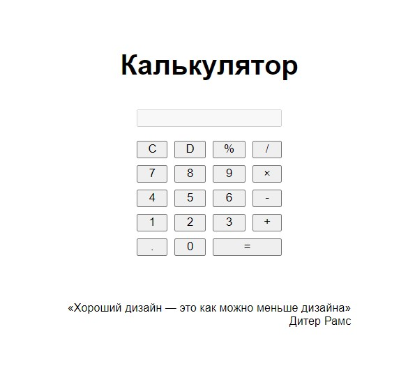

# calc



## ru: what?
Сверх-замудрёный пример Фабричного метода для калькулятора с простейшей вёрсткой и стилями.

## what?

Overly-sophisticated example of a Factory method for a calculator with a simple css view.

## who and why?

Made by Yakov Mutalenko in order to redeem his academic debt.

## license

```
        DO WHAT THE FUCK YOU WANT TO PUBLIC LICENSE
                    Version 2, December 2004

 Copyright (C) 2004 Sam Hocevar <sam@hocevar.net>

 Everyone is permitted to copy and distribute verbatim or modified
 copies of this license document, and changing it is allowed as long
 as the name is changed.

            DO WHAT THE FUCK YOU WANT TO PUBLIC LICENSE
   TERMS AND CONDITIONS FOR COPYING, DISTRIBUTION AND MODIFICATION

  0. You just DO WHAT THE FUCK YOU WANT TO.
```
